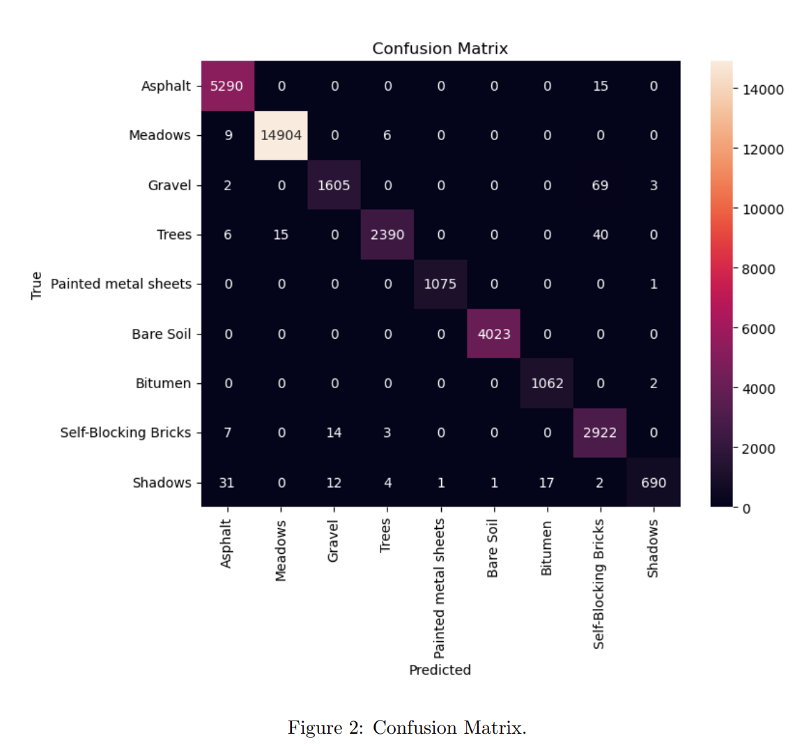

# Hyperspectral Image Classification with 3D Convolutional Neural Network

In this implementation, we address the task of hyperspectral image classification using a deep learning approach, specifically a 3D convolutional neural network (CNN). The dataset under consideration is the Pavia University hyperspectral dataset, containing spectral information for various land cover classes. The objective is to perform semantic segmentation, i.e., assign a specific class label to each pixel in the hyperspectral image.

## Overview

1. **Data Preparation:** The hyperspectral data is loaded and split into training and testing sets. Principal Component Analysis (PCA) is applied for dimensionality reduction, reducing the number of spectral bands to 15. Zero-padding is then applied to handle edge effects during convolutional operations.
   
2. **Image Patch Extraction:** The hyperspectral image is split into smaller cubes or patches to facilitate training of the 3D CNN. Each patch has a size of 25x25 pixels, corresponding to the chosen pixel size.

3. **Model Architecture:** The architecture of the 3D CNN is defined using the Keras library. It comprises three 3D convolutional layers followed by two fully connected layers. The final layer uses softmax activation to produce class probabilities. The model is compiled using the Adam optimizer and categorical cross-entropy loss.

4. **Training and Evaluation:** The model is trained on the prepared training data, and the training history is stored. Model evaluation is performed on the test set to assess its generalization performance. Metrics such as overall accuracy, average accuracy, and a confusion matrix are computed to quantify the model's effectiveness in classifying land cover types.

5. **Result Visualization:** The trained model is applied to the entire hyperspectral image to generate a classified output. The predicted classification map is visualized alongside the ground truth for qualitative analysis. Additionally, a confusion matrix heatmap is created to illustrate the model's performance in distinguishing between different land cover classes.

## Results

### Evaluation Metrics (Percentage)

1. Test Loss: 3.6073
2. Test Accuracy: 99.2402%
3. Overall Accuracy: 99.2402%
4. Average Accuracy: 98.0726%

## Conclusion

In conclusion, this implementation demonstrates the application of a 3D CNN for hyperspectral image classification. The model shows promising results in accurately categorizing land cover types within the Pavia University dataset. The combination of data preprocessing techniques, model architecture design, and training strategies contributes to the overall success of the deep learning approach in semantic segmentation tasks for hyperspectral imagery.

This breakdown provides a structured overview of the key components of the implementation and can be further expanded based on specific details and results obtained during the experimentation.

# Here are some images of the results:

